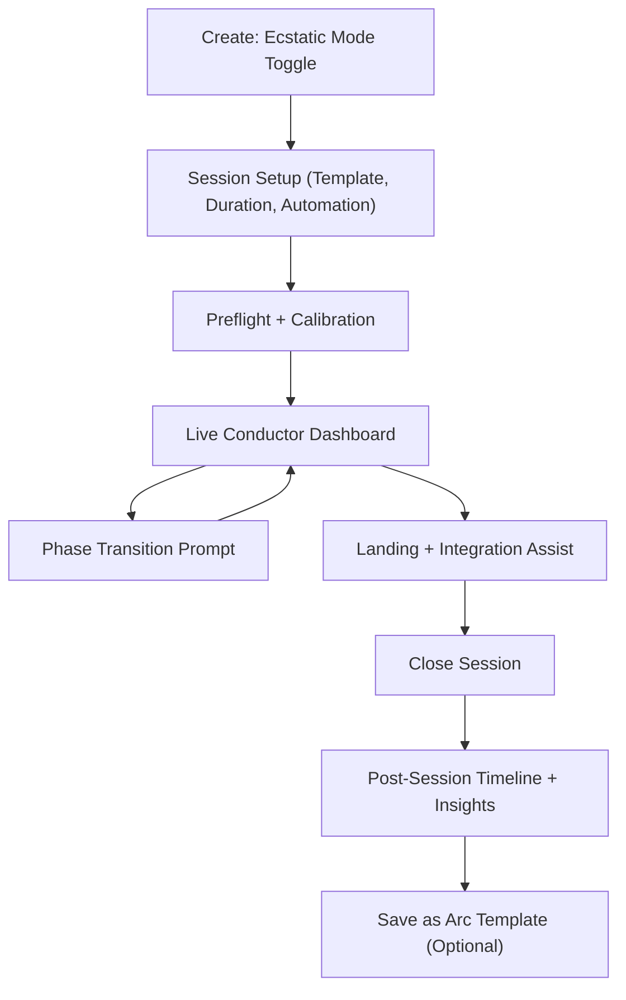

# Healing Frequency Phase 2.5 - Ecstatic Dance Conductor PRD

## 1. Product Overview

Healing Frequency Phase 2.5 introduces **Resonance Wave Conductor**, a facilitator-first mode for Ecstatic Dance journeys.

It extends the existing studio (Tone.js engine, mic analysis, adaptive journey, breath sync, room tuner, harmonic field, intention mapping) into a guided group-flow tool that:
- Reads live room and breathing signals in short windows.
- Suggests or auto-applies phase transitions along a dance arc.
- Keeps visual communication non-verbal and container-safe.
- Captures structured timeline analytics for post-session reflection and reuse.

Phase 2.5 is deliberately scoped for **single facilitator control** with future-ready data contracts for co-facilitation.

---

## 2. Objectives, Non-Goals, Success Metrics

### 2.1 Objectives

- Add a facilitator workflow optimized for Ecstatic Dance arc design and delivery.
- Convert existing advanced modules into one cohesive live conductor mode.
- Persist replayable session telemetry with low operational overhead.
- Maintain current architecture constraints (browser-first audio, Supabase persistence, no required wearables).

### 2.2 Non-Goals (Phase 2.5)

- No mandatory DJ deck integration (Serato/Rekordbox/Traktor).
- No computer-vision tracking or camera-based body analytics.
- No multi-host real-time collaborative editing yet.
- No medical diagnostics or therapeutic claims.

### 2.3 Success Metrics

- `>=25%` of advanced creators who open studio mode start at least one Ecstatic session.
- `>=40%` of Ecstatic sessions reach `completed` status (not abandoned).
- Median facilitator session duration increases by `>=20%` versus baseline advanced sessions.
- `>=30%` of completed sessions are replayed via post-session timeline within 7 days.
- Client error rate remains `<1%` during live sessions.

---

## 3. Personas

- **Facilitator/DJ**: Runs live journey, needs fast confidence signals and transition support.
- **Co-Facilitator (future)**: Assists with room energy tracking and integration pacing.
- **Reflective Creator**: Reviews session telemetry and reuses successful arc presets.

---

## 4. Feature Scope

### 4.1 Core Feature: Resonance Wave Conductor

A guided mode that orchestrates six arc phases:
- `arrival`
- `grounding`
- `build`
- `peak`
- `release`
- `integration`

Each phase modifies audio and visuals through existing engines.

### 4.2 Subsystems

- **Arc Engine**: Rule-based state machine driving phase suggestions and safe bounds.
- **Signal Aggregator**: Consumes room scan confidence, breath confidence/BPM, and live energy.
- **Conductor UI**: Minimal live dashboard with phase progress and action chips.
- **Session Replay**: Timeline and metrics summary for post-session insights.

---

## 5. Functional Requirements

### 5.1 Session Lifecycle

- Facilitator can create an Ecstatic session from `/create` flow.
- Facilitator can select arc template, duration, and automation level.
- Session status supports `draft`, `live`, `paused`, `completed`, `abandoned`.
- Session can be finalized and linked to a saved composition.

### 5.2 Arc Templates

System templates at launch:
- `gentle_wave`
- `tribal_rise`
- `cathartic_arc`
- `integration_heavy`

Template defines:
- Target phase order.
- Nominal phase durations.
- Phase-specific modulation ranges and harmonic behavior.
- Safety guardrails for peak intensity.

### 5.3 Signal Inputs (Client-Side)

Collected every 3-8 seconds as aggregated windows:
- `music_energy` (analyser mean)
- `bass_energy`
- `breath_bpm`
- `breath_confidence`
- `room_confidence`
- `room_noise_floor_db`
- `dominant_frequencies`

### 5.4 Recommendations and Guardrails

- Engine returns recommended action: `hold`, `advance`, `deepen`, `soften`, `land`.
- Peak guardrail triggers if confidence drops below threshold while energy remains high.
- Automatic shifts are only allowed when automation level is `adaptive`; otherwise action is suggestion-only.

### 5.5 Visual Language

- Non-verbal cues only in live mode (phase color, icon, progress arc, energy/coherence dial).
- Optional text details can be toggled for facilitator only.
- Overlay remains compatible with export pipeline and existing canvas capture.

### 5.6 Persistence and Replay

- Persist session metadata, phase transitions, sampled signal windows, and final summary.
- Generate post-session timeline grouped by phase.
- Allow “save as template” from successful session.

---

## 6. System Design and Integration

### 6.1 Existing Module Reuse

- `FrequencyGenerator`: live audio voices, rhythm, modulation/sweep, breath gain control.
- `MicrophoneAnalysisService`: room spectrum + amplitude windows.
- `SympatheticResonanceEngine`: dominant room tone extraction and response tones.
- `AdaptiveBinauralJourney`: phase-style beat transitions and visual modifiers.
- `BreathSyncEngine`: coherence scoring and pacing assist.
- `SolfeggioHarmonicFieldEngine`: phase-specific harmonic field layering.
- `QuantumIntentionEngine`: optional opening intention mapping.
- `VisualizationEngine` + compositor: phase overlays and dynamic layer modulation.

### 6.2 New Runtime Modules (Phase 2.5)

- `lib/audio/EcstaticArcEngine.ts`
  - Deterministic phase rules and recommendation output.
- `lib/audio/CollectiveResonanceAggregator.ts`
  - Windowed signal normalization and score synthesis.
- `components/audio/EcstaticConductorPanel.tsx`
  - Dedicated facilitator panel embedded in `FrequencyCreator`.
- `components/audio/EcstaticSessionTimeline.tsx`
  - Post-session replay/timeline view.

---

## 7. Data Model (Supabase)

## 7.1 Schema Changes

### 7.1.1 New Columns

```sql
alter table if exists public.compositions
  add column if not exists ritual_mode text,
  add column if not exists ecstatic_session_id uuid;
```

### 7.1.2 New Tables

```sql
create table if not exists public.ecstatic_arc_templates (
  id uuid primary key default uuid_generate_v4(),
  key text not null unique,
  name text not null,
  description text,
  phase_plan jsonb not null,
  default_config jsonb not null,
  is_system boolean not null default true,
  created_by uuid references public.profiles(id) on delete set null,
  created_at timestamp with time zone default now(),
  updated_at timestamp with time zone default now()
);

create table if not exists public.ecstatic_sessions (
  id uuid primary key default uuid_generate_v4(),
  user_id uuid not null references public.profiles(id) on delete cascade,
  composition_id uuid references public.compositions(id) on delete set null,
  template_id uuid references public.ecstatic_arc_templates(id) on delete set null,
  status text not null default 'draft',
  title text,
  location_label text,
  automation_level text not null default 'assisted',
  session_minutes integer not null,
  started_at timestamp with time zone,
  ended_at timestamp with time zone,
  current_phase text,
  current_phase_progress numeric,
  overall_progress numeric,
  energy_score numeric,
  coherence_score numeric,
  resonance_confidence numeric,
  recommendations jsonb,
  ecstatic_config jsonb not null,
  summary jsonb,
  created_at timestamp with time zone default now(),
  updated_at timestamp with time zone default now(),
  check (status in ('draft', 'live', 'paused', 'completed', 'abandoned')),
  check (automation_level in ('manual', 'assisted', 'adaptive'))
);

create table if not exists public.ecstatic_phase_events (
  id uuid primary key default uuid_generate_v4(),
  session_id uuid not null references public.ecstatic_sessions(id) on delete cascade,
  user_id uuid not null references public.profiles(id) on delete cascade,
  phase text not null,
  transition_type text not null,
  started_at timestamp with time zone not null,
  ended_at timestamp with time zone,
  duration_seconds integer,
  input_snapshot jsonb,
  output_snapshot jsonb,
  notes text,
  created_at timestamp with time zone default now(),
  check (transition_type in ('manual', 'suggested', 'auto', 'override'))
);

create table if not exists public.ecstatic_signal_samples (
  id uuid primary key default uuid_generate_v4(),
  session_id uuid not null references public.ecstatic_sessions(id) on delete cascade,
  user_id uuid not null references public.profiles(id) on delete cascade,
  sampled_at timestamp with time zone not null,
  window_seconds integer not null default 5,
  phase text,
  music_energy numeric,
  bass_energy numeric,
  breath_bpm numeric,
  breath_confidence numeric,
  room_confidence numeric,
  room_noise_floor_db numeric,
  dominant_frequencies jsonb,
  recommended_action text,
  applied_action text,
  created_at timestamp with time zone default now()
);
```

### 7.1.3 Constraints and FK add-ons

```sql
do $$
begin
  if not exists (
    select 1
    from pg_constraint
    where conname = 'compositions_ecstatic_session_id_fkey'
  ) then
    alter table public.compositions
      add constraint compositions_ecstatic_session_id_fkey
      foreign key (ecstatic_session_id)
      references public.ecstatic_sessions(id)
      on delete set null;
  end if;
end
$$;
```

### 7.1.4 Indexes

```sql
create index if not exists idx_ecstatic_templates_key
  on public.ecstatic_arc_templates(key);

create index if not exists idx_ecstatic_sessions_user_created
  on public.ecstatic_sessions(user_id, created_at desc);

create index if not exists idx_ecstatic_sessions_status
  on public.ecstatic_sessions(status);

create index if not exists idx_ecstatic_phase_events_session_started
  on public.ecstatic_phase_events(session_id, started_at asc);

create index if not exists idx_ecstatic_signal_samples_session_sampled
  on public.ecstatic_signal_samples(session_id, sampled_at asc);

create index if not exists idx_ecstatic_signal_samples_phase
  on public.ecstatic_signal_samples(phase);
```

## 7.2 RLS Policies

```sql
alter table if exists public.ecstatic_arc_templates enable row level security;
alter table if exists public.ecstatic_sessions enable row level security;
alter table if exists public.ecstatic_phase_events enable row level security;
alter table if exists public.ecstatic_signal_samples enable row level security;

-- Templates: public read if system template; custom templates read/write by owner
create policy "Ecstatic templates readable"
  on public.ecstatic_arc_templates
  for select
  using (is_system = true or created_by = auth.uid());

create policy "Ecstatic templates insert own"
  on public.ecstatic_arc_templates
  for insert
  with check (created_by = auth.uid() or is_system = true);

create policy "Ecstatic templates update own"
  on public.ecstatic_arc_templates
  for update
  using (created_by = auth.uid());

create policy "Ecstatic templates delete own"
  on public.ecstatic_arc_templates
  for delete
  using (created_by = auth.uid());

-- Sessions/events/samples: owner only
create policy "Ecstatic sessions owner select"
  on public.ecstatic_sessions
  for select
  using (user_id = auth.uid());

create policy "Ecstatic sessions owner insert"
  on public.ecstatic_sessions
  for insert
  with check (user_id = auth.uid());

create policy "Ecstatic sessions owner update"
  on public.ecstatic_sessions
  for update
  using (user_id = auth.uid());

create policy "Ecstatic sessions owner delete"
  on public.ecstatic_sessions
  for delete
  using (user_id = auth.uid());

create policy "Ecstatic phase events owner select"
  on public.ecstatic_phase_events
  for select
  using (user_id = auth.uid());

create policy "Ecstatic phase events owner insert"
  on public.ecstatic_phase_events
  for insert
  with check (user_id = auth.uid());

create policy "Ecstatic signal samples owner select"
  on public.ecstatic_signal_samples
  for select
  using (user_id = auth.uid());

create policy "Ecstatic signal samples owner insert"
  on public.ecstatic_signal_samples
  for insert
  with check (user_id = auth.uid());
```

## 7.3 Data Retention

- Raw `ecstatic_signal_samples` retained 30 days (scheduled cleanup job).
- Session summary and phase events retained indefinitely.
- Optional export before deletion for premium tier in future phase.

---

## 8. API Contract

Base namespace: `/api/ecstatic`

All endpoints require authenticated user except template read for system templates.

## 8.1 Templates

### `GET /api/ecstatic/templates`

Purpose: list system + user templates.

Response:

```json
{
  "templates": [
    {
      "id": "uuid",
      "key": "gentle_wave",
      "name": "Gentle Wave",
      "description": "Soft build with long integration",
      "phasePlan": [
        { "phase": "arrival", "minutes": 6 },
        { "phase": "grounding", "minutes": 8 },
        { "phase": "build", "minutes": 18 },
        { "phase": "peak", "minutes": 14 },
        { "phase": "release", "minutes": 10 },
        { "phase": "integration", "minutes": 10 }
      ],
      "isSystem": true
    }
  ]
}
```

## 8.2 Session Lifecycle

### `POST /api/ecstatic/sessions`

Purpose: create draft session.

Request:

```json
{
  "title": "Sunday Community Wave",
  "templateId": "uuid",
  "sessionMinutes": 66,
  "automationLevel": "assisted",
  "locationLabel": "Downtown Loft",
  "ecstaticConfig": {
    "peakGuardrailEnabled": true,
    "phaseAutoAdvance": false,
    "showTextHints": false,
    "targetCoherence": 0.72,
    "breathInfluence": 0.35,
    "roomInfluence": 0.3,
    "energyInfluence": 0.35
  }
}
```

Response: `201`

```json
{
  "session": {
    "id": "uuid",
    "status": "draft",
    "currentPhase": "arrival",
    "createdAt": "ISO-8601"
  }
}
```

### `PATCH /api/ecstatic/sessions/:id/state`

Purpose: start, pause, resume, abandon.

Request:

```json
{
  "action": "start"
}
```

Valid actions: `start`, `pause`, `resume`, `abandon`.

Response: `200` with updated state snapshot.

### `POST /api/ecstatic/sessions/:id/phase-transition`

Purpose: record phase transition and update current phase.

Request:

```json
{
  "phase": "build",
  "transitionType": "manual",
  "startedAt": "ISO-8601",
  "inputSnapshot": {
    "energyScore": 0.71,
    "coherenceScore": 0.56,
    "resonanceConfidence": 0.68
  },
  "outputSnapshot": {
    "recommendedAction": "deepen",
    "harmonicIntensity": 0.74,
    "binauralBeatHz": 11.5
  },
  "notes": "Room responded quickly to bass increase"
}
```

Response: `200`

```json
{
  "ok": true,
  "session": {
    "id": "uuid",
    "currentPhase": "build",
    "overallProgress": 0.43
  }
}
```

### `POST /api/ecstatic/sessions/:id/close`

Purpose: complete session and persist summary; optional composition link.

Request:

```json
{
  "status": "completed",
  "compositionId": "uuid",
  "summary": {
    "averageEnergy": 0.64,
    "averageCoherence": 0.59,
    "peakEnergy": 0.91,
    "peakPhase": "peak",
    "phaseDurations": {
      "arrival": 420,
      "grounding": 540,
      "build": 1080,
      "peak": 780,
      "release": 620,
      "integration": 560
    }
  }
}
```

Response: `200` session finalized payload.

## 8.3 Telemetry Ingest

### `POST /api/ecstatic/sessions/:id/samples/batch`

Purpose: ingest aggregated live signal windows (not raw audio).

Request:

```json
{
  "samples": [
    {
      "sampledAt": "ISO-8601",
      "windowSeconds": 5,
      "phase": "build",
      "musicEnergy": 0.67,
      "bassEnergy": 0.73,
      "breathBpm": 6.2,
      "breathConfidence": 0.61,
      "roomConfidence": 0.74,
      "roomNoiseFloorDb": -66.2,
      "dominantFrequencies": [63, 126, 252],
      "recommendedAction": "hold",
      "appliedAction": "hold"
    }
  ]
}
```

Response:

```json
{
  "accepted": 1,
  "dropped": 0
}
```

## 8.4 Replay and Reporting

### `GET /api/ecstatic/sessions/:id`

Returns full session metadata + latest recommendation.

### `GET /api/ecstatic/sessions/:id/timeline`

Returns ordered phase events and downsampled time series for charting.

Response excerpt:

```json
{
  "events": [
    { "phase": "arrival", "startedAt": "...", "endedAt": "...", "transitionType": "manual" },
    { "phase": "grounding", "startedAt": "...", "endedAt": "...", "transitionType": "suggested" }
  ],
  "metrics": {
    "energy": [{ "t": "...", "v": 0.55 }],
    "coherence": [{ "t": "...", "v": 0.62 }],
    "confidence": [{ "t": "...", "v": 0.7 }]
  }
}
```

## 8.5 Error Model

- `400` validation error (`INVALID_PHASE`, `INVALID_STATE_ACTION`)
- `401` auth required
- `403` not owner
- `404` session/template not found
- `409` illegal state transition
- `422` malformed telemetry batch

---

## 9. UI Wireflow

## 9.1 Primary Flow Diagram



## 9.2 Screen Wireflow (Textual)

### Screen A: Session Setup

- Entry point in `FrequencyCreator` with `Ecstatic Dance Mode` toggle.
- Inputs:
  - Template selector
  - Duration (minutes)
  - Automation level (`manual`, `assisted`, `adaptive`)
  - Optional intention text seed
- Actions:
  - `Start Calibration`
  - `Skip Calibration`

### Screen B: Preflight + Calibration

- Room scan card (confidence + dominant frequencies).
- Breath baseline card (mode + confidence).
- Readiness checklist:
  - Mic permission
  - Headphones/monitor confirmation
  - Visual overlay preference
- Actions:
  - `Recalibrate`
  - `Enter Live Mode`

### Screen C: Live Conductor Dashboard

- Top rail:
  - Current phase badge
  - Overall progress ring
  - Session timer
- Middle:
  - Collective Resonance Dial (energy/coherence/confidence)
  - Suggested action chip (color-coded)
- Bottom controls:
  - `Hold`
  - `Advance Phase`
  - `Soften`
  - `Land`
  - `Pause Session`
- Side panel (optional): detailed metrics and module toggles.

### Screen D: Phase Transition Prompt

- Triggered by suggestion or manual tap.
- Displays:
  - Reason summary (short)
  - Proposed parameter shifts (beat offset, harmonic intensity, visual speed)
- Actions:
  - `Apply`
  - `Apply and Lock 3m`
  - `Dismiss`

### Screen E: Integration + Close

- Prominent “Landing support active” state.
- Breath coherence bar and gradual intensity taper.
- Actions:
  - `Complete Session`
  - `Abandon Session`

### Screen F: Post-Session Replay

- Timeline segmented by phase.
- Metrics chart tabs: energy, coherence, confidence.
- Summary cards:
  - Peak moment
  - Stability score
  - Phase balance score
- Actions:
  - `Attach to Composition`
  - `Save Arc as Template`
  - `Export Session Summary`

## 9.3 Interaction Rules

- Live dashboard defaults to non-verbal icon mode.
- Text hints shown only when `showTextHints=true`.
- In adaptive mode, auto-transition requires minimum confidence and cooldown.
- Mobile view hides secondary metrics by default for low cognitive load.

---

## 10. Rollout Slices

## Slice 0 - Foundation (Week 1)

Scope:
- DB migrations (`ecstatic_*` tables + composition columns).
- Base API endpoints for templates and session lifecycle.
- Feature flag: `ecstatic_conductor_enabled`.

Acceptance:
- Can create, start, pause, abandon, and complete an Ecstatic session.
- Data persists correctly with RLS owner boundaries.

## Slice 1 - Facilitator MVP (Weeks 2-3)

Scope:
- Setup screen + calibration screen + live dashboard shell.
- Manual phase transitions with event logging.
- Telemetry batch ingest every 5 seconds.

Acceptance:
- Facilitator can run full arc manually and see live dial updates.
- Post-session timeline renders from persisted events and samples.

## Slice 2 - Assisted Intelligence (Weeks 4-5)

Scope:
- `EcstaticArcEngine` recommendation logic.
- Suggestion chips and transition prompt.
- Peak guardrail enforcement in assisted/adaptive modes.

Acceptance:
- Suggestions generated at runtime from signal windows.
- Guardrail triggers verifiably reduce unsafe peak overshoot scenarios.

## Slice 3 - Adaptive Automation (Weeks 6-7)

Scope:
- Auto-apply phase transitions under adaptive policy.
- Continuous modulation mapping into existing audio modules.
- Visual overlay phase behavior presets.

Acceptance:
- Auto transitions occur only when policy thresholds are met.
- Facilitator can override at any time with no state corruption.

## Slice 4 - Replay and Reuse (Week 8)

Scope:
- Post-session scoring and summary cards.
- Save completed session as reusable arc template.
- Profile integration for Ecstatic session history.

Acceptance:
- Completed sessions generate summary JSON and timeline replay.
- Saved template appears in setup selector and can start new session.

---

## 11. QA and Validation Plan

## 11.1 Functional

- Session lifecycle transition tests (`draft -> live -> paused -> live -> completed`).
- Phase event ordering and duration consistency tests.
- Telemetry ingest validation and out-of-order handling.

## 11.2 Audio/UX

- Verify no audio interruption on phase transition apply/dismiss.
- Verify breath + room signals degrade gracefully when mic denied.
- Verify low-power visual fallback remains active under load.

## 11.3 Security

- RLS owner-only access tests for all `ecstatic_*` tables.
- Endpoint auth enforcement and IDOR checks.

## 11.4 Analytics

New tracked events:
- `ecstatic_session_created`
- `ecstatic_session_started`
- `ecstatic_phase_transitioned`
- `ecstatic_recommendation_applied`
- `ecstatic_guardrail_triggered`
- `ecstatic_session_completed`
- `ecstatic_template_saved_from_session`

---

## 12. Risks and Mitigations

- **Signal quality variability**: confidence-weighted recommendations; fallback to manual mode.
- **Cognitive overload in live facilitation**: one-primary-action UI with optional detail panel.
- **Over-automation trust risk**: explicit automation levels and always-available manual override.
- **Data volume growth**: windowed sample ingest + 30-day retention policy.

---

## 13. Open Questions

- Should system templates be locale-specific in naming and guidance language?
- Should completed Ecstatic sessions be discoverable publicly or private by default?
- Do we need facilitator-only role abstraction now or defer to Phase 3 collaboration?
- What threshold policy should define “safe to crest” for adaptive transitions?

---

## 14. Deliverables Checklist

- [ ] Migration SQL files for `ecstatic_*` schema and composition linkage.
- [ ] Route handlers under `/app/api/ecstatic/*`.
- [ ] `EcstaticArcEngine` + `CollectiveResonanceAggregator` implementation.
- [ ] `EcstaticConductorPanel` and live dashboard integration in `FrequencyCreator`.
- [ ] Post-session timeline UI and profile history section.
- [ ] Event tracking and QA coverage for lifecycle + RLS.

