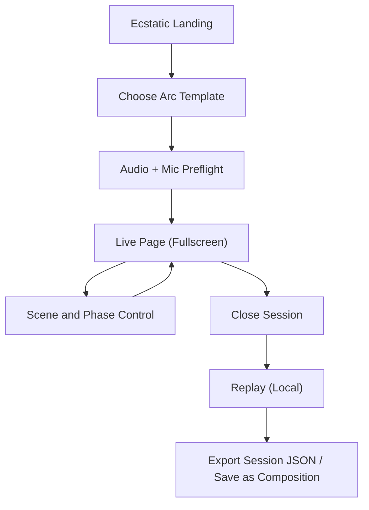

# Healing Frequency Phase 2.5B - Ecstatic Dance Standalone Experience (No-DB Version)

## 1. Product Overview

This version defines **Resonance Wave Conductor** as a **separate feature page** dedicated to Ecstatic Dance.

Primary shift from the prior proposal:
- Dedicated route and UX flow, not embedded as a subsection of the general creator page.
- **No database schema changes** and no new Supabase tables/columns.
- Strong emphasis on **visual choreography** and real-time visual transitions.

The experience is facilitator-first but dancer-friendly, using existing browser audio + mic capabilities and existing rendering infrastructure.

---

## 2. Scope Constraints

### 2.1 Hard Constraints

- No SQL migrations.
- No new Supabase tables.
- No updates to existing table schemas.
- No new RLS policies required.

### 2.2 Architectural Strategy Under Constraints

- Store live Ecstatic session state in client memory and local storage.
- Reuse existing modules:
  - `FrequencyGenerator`
  - `MicrophoneAnalysisService`
  - `BreathSyncEngine`
  - `AdaptiveBinauralJourney`
  - `SympatheticResonanceEngine`
  - `SolfeggioHarmonicFieldEngine`
  - visualization compositor/renderers
- Optional persistence uses existing composition save path and existing JSON fields (`audio_config`, `visualization_layers`) only.

---

## 3. Goals, Non-Goals, Success Metrics

### 3.1 Goals

- Deliver a complete Ecstatic Dance flow in a standalone page.
- Increase immersion through richer visuals and scene transitions.
- Keep facilitation fast with low-friction controls.
- Avoid backend/data-model risk while validating product demand.

### 3.2 Non-Goals

- No multi-facilitator real-time collaboration.
- No new account/profile analytics storage specific to Ecstatic sessions.
- No camera tracking or body-pose inference.
- No DJ software integration in this phase.

### 3.3 Success Metrics

- `>=30%` of users entering `/ecstatic` reach live mode.
- `>=50%` of live sessions run for 20+ minutes.
- `>=40%` of sessions use 3+ visual scenes.
- Session crash/error rate remains `<1%`.

---

## 4. Information Architecture and Routing

### 4.1 New Dedicated Routes

- `/[locale]/ecstatic`
  - Landing + template selection + preflight.
- `/[locale]/ecstatic/live`
  - Fullscreen live conductor experience.
- `/[locale]/ecstatic/replay`
  - Local replay and export/import only.
- `/[locale]/ecstatic/visual-lab`
  - Visualization scene builder and preview.

### 4.2 Navigation Entry Points

- Header CTA: `Ecstatic Dance`.
- Create page shortcut card: `Open Ecstatic Mode`.
- Optional deep link after first advanced playback.

---

## 5. User Experience Flow (Standalone)



### 5.1 Screen A - Landing

Inputs:
- Arc template.
- Session duration.
- Automation level (`manual`, `assisted`, `adaptive-light`).
- Visual pack (`organic`, `tribal`, `cosmic`, `minimal`).

Actions:
- `Start Preflight`
- `Open Visual Lab`

### 5.2 Screen B - Preflight

Checks:
- Audio output unlocked.
- Mic permission and baseline confidence.
- Device power profile (for visual complexity fallback).

Actions:
- `Recheck`
- `Start Live Session`

### 5.3 Screen C - Live (Fullscreen)

Regions:
- Top rail: timer, current phase, overall progress.
- Center stage: high-impact visualization scene.
- Bottom controls: hold, advance, soften, land, pause.
- Right drawer: scene stack + parameter sliders.

### 5.4 Screen D - Replay (Local)

- Local timeline of phase changes.
- Scene changes and key moments.
- Export/import session JSON.
- Optional “Send to Create” to prefill composition with current audio + visual config.

---

## 6. Feature Requirements

### 6.1 Arc and Facilitation

- System phases:
  - `arrival`
  - `grounding`
  - `build`
  - `peak`
  - `release`
  - `integration`
- Facilitator can transition manually at any time.
- Assisted mode provides suggestions from live metrics.
- Adaptive-light mode can auto-adjust intensity and visual speed, but phase transitions remain facilitator-confirmed.

### 6.2 Live Signal Inputs

Collected as rolling windows (3-6 seconds):
- Audio energy and bass energy from analyser.
- Breath BPM/confidence from amplitude envelope sampling.
- Room confidence and dominant frequencies from spectrum snapshots.

### 6.3 Control Model

- One primary action button highlighted at any time (`hold`, `advance`, or `land`).
- Emergency softening shortcut reduces:
  - harmonic intensity
  - modulation depth
  - visual speed and contrast
- Phase lock timer to avoid accidental rapid switching.

---

## 7. Visualization-First Expansion

This phase prioritizes visual differentiation.

### 7.1 New Scene Library (More Visualization)

Add the following scene types on top of existing renderers:

- `pulse_tunnel`
  - Spiral corridor with beat-linked depth warp.
- `tribal_constellation`
  - Particle clusters that form and dissolve geometric glyphs.
- `kinetic_mandala`
  - Layered sacred geometry with rotational parallax.
- `liquid_ripple_field`
  - Multi-origin ripples with bass-reactive refraction.
- `ember_rain`
  - Slow falling emissive particles for release/integration.
- `body_echo_trails`
  - Persistent waveform ribbons with temporal decay.
- `prism_bloom`
  - Gradient prism bursts on high-energy transients.
- `void_breath_orb`
  - Minimal central orb synced with breath phase.

### 7.2 Scene Stack and Transition Engine

- Live scene stack supports 1-4 active scenes.
- Per-scene controls:
  - opacity
  - blend mode
  - intensity
  - speed
  - scale
  - palette
- Transition types:
  - `crossfade`
  - `flash-cut`
  - `spiral-morph`
  - `luma-dissolve`
- Transition duration range: `0.6s - 8s`.

### 7.3 Phase-to-Visual Mapping Presets

Default mapping:
- `arrival`: `void_breath_orb` + low saturation gradient
- `grounding`: `kinetic_mandala` + `liquid_ripple_field`
- `build`: `pulse_tunnel` + `prism_bloom`
- `peak`: `tribal_constellation` + `body_echo_trails`
- `release`: `liquid_ripple_field` + `ember_rain`
- `integration`: `void_breath_orb` + soft mandala

### 7.4 Performance Rules

- Auto downgrade on low-power devices:
  - cap active scenes at 2
  - reduce particle count
  - clamp post-processing effects
- Preserve smoothness target:
  - desktop target: 50-60 FPS
  - low-power fallback: stable 30 FPS

### 7.5 Visual Lab Page

`/[locale]/ecstatic/visual-lab` provides:
- Scene audition grid.
- Layer stack editor.
- Palette and motion curve editor.
- Save/load presets locally (browser storage).

---

## 8. Technical Design

### 8.1 New Frontend Modules

- `app/[locale]/(main)/ecstatic/page.tsx`
- `app/[locale]/(main)/ecstatic/live/page.tsx`
- `app/[locale]/(main)/ecstatic/replay/page.tsx`
- `app/[locale]/(main)/ecstatic/visual-lab/page.tsx`
- `components/ecstatic/EcstaticSessionSetup.tsx`
- `components/ecstatic/EcstaticLiveStage.tsx`
- `components/ecstatic/EcstaticConductorControls.tsx`
- `components/ecstatic/EcstaticReplayPanel.tsx`
- `components/ecstatic/SceneStackEditor.tsx`

### 8.2 New Logic Modules

- `lib/ecstatic/EcstaticArcEngine.ts`
- `lib/ecstatic/EcstaticSessionStore.ts`
- `lib/ecstatic/EcstaticSignalAggregator.ts`
- `lib/ecstatic/EcstaticVisualOrchestrator.ts`
- `lib/visualization/renderers/*` (new scene renderers listed above)

### 8.3 Existing Module Integrations

- `FrequencyGenerator` remains audio source of truth.
- `MicrophoneAnalysisService` used for room + breath sampling windows.
- `WaveformVisualizer`/`ThreeVisualizer` upgraded to scene orchestration mode.
- Existing export path reused for audio/video capture.

---

## 9. Data and Persistence (No DB Update)

### 9.1 Session Storage

No server-side session table. Use:
- in-memory store for live runtime.
- local storage for drafts and replay snapshots.

Example local payload:

```json
{
  "version": 1,
  "id": "local-uuid",
  "startedAt": "ISO-8601",
  "endedAt": "ISO-8601",
  "template": "tribal_rise",
  "durationMinutes": 60,
  "phaseEvents": [
    { "phase": "arrival", "at": "ISO-8601", "type": "manual" }
  ],
  "samples": [
    {
      "at": "ISO-8601",
      "energy": 0.66,
      "coherence": 0.58,
      "roomConfidence": 0.72
    }
  ],
  "sceneChanges": [
    {
      "at": "ISO-8601",
      "from": "kinetic_mandala",
      "to": "pulse_tunnel",
      "transition": "crossfade"
    }
  ],
  "audioConfig": {},
  "visualConfig": {}
}
```

### 9.2 Optional Composition Save

If user taps `Save as Composition`, reuse existing composition insert with:
- `audio_config`: includes ecstatic runtime metadata inside existing JSON object.
- `visualization_layers`: scene stack snapshot.
- `tags`: include `ecstatic-dance`.

No schema change is required.

### 9.3 Import/Export

- Export local session as `.json`.
- Import `.json` to replay or reuse settings.

---

## 10. API Contract (No New DB Dependency)

This version is frontend-heavy.

### 10.1 Required Backend Changes

- None required for MVP live flow.

### 10.2 Optional Stateless Endpoints (Recommended)

These endpoints are optional and do not write to DB.

### `GET /api/ecstatic/templates`

Returns static template presets from server file.

### `POST /api/ecstatic/recommend`

Input: current phase + signal window.
Output: suggested action + confidence.

No persistence side effects.

Example request:

```json
{
  "phase": "build",
  "elapsedSeconds": 1420,
  "metrics": {
    "energy": 0.74,
    "coherence": 0.51,
    "roomConfidence": 0.69,
    "breathBpm": 6.3
  }
}
```

Example response:

```json
{
  "action": "hold",
  "confidence": 0.77,
  "reasons": ["Energy rising while coherence is stable", "Room confidence above threshold"],
  "recommendedVisualShift": {
    "speed": 1.08,
    "intensity": 0.84,
    "transition": "spiral-morph"
  }
}
```

---

## 11. Rollout Slices

## Slice A - Standalone Page Foundation (Week 1)

Scope:
- New route structure and navigation entry.
- Session setup + preflight + live shell.
- Local store and local replay skeleton.

Acceptance:
- User can complete full flow without touching DB migration.

## Slice B - Visualization Expansion (Weeks 2-3)

Scope:
- Implement at least 4 new scenes (`pulse_tunnel`, `tribal_constellation`, `liquid_ripple_field`, `void_breath_orb`).
- Scene stack editor + transitions.
- Visual Lab page.

Acceptance:
- User can switch scenes live with smooth transitions.
- Low-power fallback triggers correctly.

## Slice C - Facilitation Intelligence (Weeks 4-5)

Scope:
- Arc engine + suggestions.
- Assisted controls and safety softening shortcut.
- Optional stateless recommendation endpoint.

Acceptance:
- Live suggestions update from signal windows.
- Manual override always available.

## Slice D - Replay and Composition Bridge (Week 6)

Scope:
- Replay charts from local snapshots.
- JSON import/export.
- Save to existing composition model (no schema changes).

Acceptance:
- Session can be exported/imported and bridged into composition save flow.

---

## 12. QA Plan

### 12.1 Functional

- Route-level flow tests for setup -> live -> replay.
- Phase transition correctness with lock timer behavior.
- Import/export round-trip validity tests.

### 12.2 Visual

- Scene rendering validation across Chrome/Safari/Firefox.
- Transition smoothness and no-black-frame guarantees.
- Low-power mode verification on mobile and low-core devices.

### 12.3 Audio and Mic

- Mic permission denial fallback behavior.
- Breath and room sampling resilience under noisy input.
- No audio dropout when switching scenes.

---

## 13. Risks and Mitigations

- **Risk: visual overload**
  - Mitigation: curated scene packs + one-tap phase presets.
- **Risk: device performance issues**
  - Mitigation: strict quality tiers and auto downgrade.
- **Risk: no server telemetry for analytics depth**
  - Mitigation: local replay exports and optional composition save bridge.

---

## 14. Deliverables

- [ ] Dedicated Ecstatic route group and pages.
- [ ] Arc setup/live/replay UI components.
- [ ] New visualization scene renderers and transitions.
- [ ] Local session store + import/export.
- [ ] Optional stateless recommendation API.
- [ ] Composition bridge with existing schema only.

