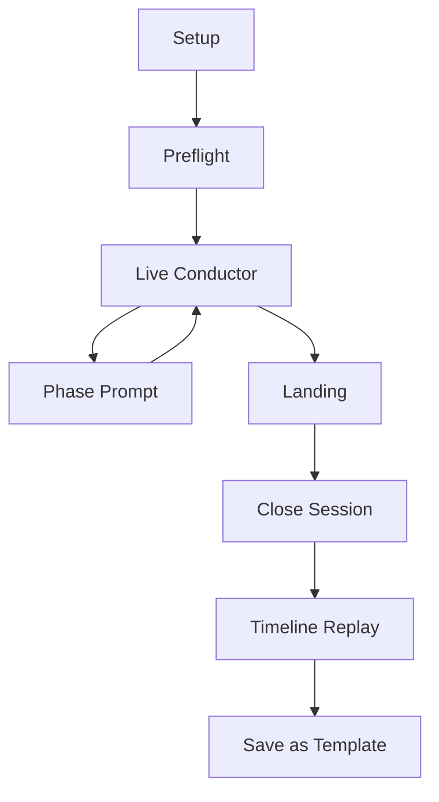

# Healing Frequency Phase 2.5A - Ecstatic Dance Conductor (With DB + API)

## 1. Product Overview

Phase 2.5A introduces **Resonance Wave Conductor**, a facilitator-first Ecstatic Dance feature integrated with the existing Healing Frequency studio.

This version includes:
- Structured persistence for session timelines and phase events.
- API contracts for lifecycle, telemetry ingest, and replay.
- Existing engine reuse (Tone.js, mic analysis, adaptive modules).

This variant is designed for teams that want measurable usage data, replay analytics, and template reuse across sessions.

---

## 2. Goals and Non-Goals

### 2.1 Goals

- Help facilitators manage Ecstatic Dance arcs with live guidance.
- Persist session structure and signal trends for reflection and reuse.
- Reuse existing audio and visualization architecture.
- Keep runtime stable on desktop and mobile.

### 2.2 Non-Goals

- No mandatory DJ software integration in this phase.
- No camera/computer-vision movement tracking.
- No multi-facilitator co-editing yet.

---

## 3. User Personas

- **Facilitator/DJ**: needs phase-aware guidance and low-friction controls.
- **Ritual Host**: values opening/closing structure and safe landings.
- **Reflective Creator**: wants post-session timeline and reusable templates.

---

## 4. Core Feature Scope

### 4.1 Arc Model

Session phases:
- `arrival`
- `grounding`
- `build`
- `peak`
- `release`
- `integration`

### 4.2 Live Signals

Windowed inputs (3-8s):
- `music_energy`
- `bass_energy`
- `breath_bpm`
- `breath_confidence`
- `room_confidence`
- `dominant_frequencies`
- `noise_floor_db`

### 4.3 Runtime Outputs

- Suggestion actions: `hold`, `advance`, `deepen`, `soften`, `land`.
- Safe bounds on peak when coherence/confidence drop.
- Visual scene intensity/speed modulation by phase.

---

## 5. Technical Design

### 5.1 Reused Modules

- `lib/audio/FrequencyGenerator.ts`
- `lib/audio/MicrophoneAnalysisService.ts`
- `lib/audio/BreathSyncEngine.ts`
- `lib/audio/AdaptiveBinauralJourney.ts`
- `lib/audio/SympatheticResonanceEngine.ts`
- `lib/audio/SolfeggioHarmonicFieldEngine.ts`
- `lib/visualization/VisualizationEngine.ts`
- `lib/visualization/renderers/CompositorRenderer.ts`

### 5.2 New Modules

- `lib/ecstatic/EcstaticArcEngine.ts`
- `lib/ecstatic/CollectiveResonanceAggregator.ts`
- `components/audio/EcstaticConductorPanel.tsx`
- `components/audio/EcstaticSessionTimeline.tsx`

### 5.3 UX Entry

- Add Ecstatic mode entry inside create flow.
- Dedicated conductor panel appears when Ecstatic mode is enabled.

---

## 6. Data Model (Supabase)

### 6.1 Schema Updates

```sql
alter table if exists public.compositions
  add column if not exists ritual_mode text,
  add column if not exists ecstatic_session_id uuid;
```

### 6.2 New Tables

```sql
create table if not exists public.ecstatic_arc_templates (
  id uuid primary key default uuid_generate_v4(),
  key text not null unique,
  name text not null,
  description text,
  phase_plan jsonb not null,
  default_config jsonb not null,
  is_system boolean not null default true,
  created_by uuid references public.profiles(id) on delete set null,
  created_at timestamp with time zone default now(),
  updated_at timestamp with time zone default now()
);

create table if not exists public.ecstatic_sessions (
  id uuid primary key default uuid_generate_v4(),
  user_id uuid not null references public.profiles(id) on delete cascade,
  composition_id uuid references public.compositions(id) on delete set null,
  template_id uuid references public.ecstatic_arc_templates(id) on delete set null,
  status text not null default 'draft',
  title text,
  location_label text,
  automation_level text not null default 'assisted',
  session_minutes integer not null,
  started_at timestamp with time zone,
  ended_at timestamp with time zone,
  current_phase text,
  current_phase_progress numeric,
  overall_progress numeric,
  energy_score numeric,
  coherence_score numeric,
  resonance_confidence numeric,
  recommendations jsonb,
  ecstatic_config jsonb not null,
  summary jsonb,
  created_at timestamp with time zone default now(),
  updated_at timestamp with time zone default now(),
  check (status in ('draft', 'live', 'paused', 'completed', 'abandoned')),
  check (automation_level in ('manual', 'assisted', 'adaptive'))
);

create table if not exists public.ecstatic_phase_events (
  id uuid primary key default uuid_generate_v4(),
  session_id uuid not null references public.ecstatic_sessions(id) on delete cascade,
  user_id uuid not null references public.profiles(id) on delete cascade,
  phase text not null,
  transition_type text not null,
  started_at timestamp with time zone not null,
  ended_at timestamp with time zone,
  duration_seconds integer,
  input_snapshot jsonb,
  output_snapshot jsonb,
  notes text,
  created_at timestamp with time zone default now(),
  check (transition_type in ('manual', 'suggested', 'auto', 'override'))
);

create table if not exists public.ecstatic_signal_samples (
  id uuid primary key default uuid_generate_v4(),
  session_id uuid not null references public.ecstatic_sessions(id) on delete cascade,
  user_id uuid not null references public.profiles(id) on delete cascade,
  sampled_at timestamp with time zone not null,
  window_seconds integer not null default 5,
  phase text,
  music_energy numeric,
  bass_energy numeric,
  breath_bpm numeric,
  breath_confidence numeric,
  room_confidence numeric,
  room_noise_floor_db numeric,
  dominant_frequencies jsonb,
  recommended_action text,
  applied_action text,
  created_at timestamp with time zone default now()
);
```

### 6.3 Foreign Key Add-on

```sql
do $$
begin
  if not exists (
    select 1 from pg_constraint where conname = 'compositions_ecstatic_session_id_fkey'
  ) then
    alter table public.compositions
      add constraint compositions_ecstatic_session_id_fkey
      foreign key (ecstatic_session_id)
      references public.ecstatic_sessions(id)
      on delete set null;
  end if;
end
$$;
```

### 6.4 Indexes

```sql
create index if not exists idx_ecstatic_templates_key
  on public.ecstatic_arc_templates(key);

create index if not exists idx_ecstatic_sessions_user_created
  on public.ecstatic_sessions(user_id, created_at desc);

create index if not exists idx_ecstatic_sessions_status
  on public.ecstatic_sessions(status);

create index if not exists idx_ecstatic_phase_events_session_started
  on public.ecstatic_phase_events(session_id, started_at asc);

create index if not exists idx_ecstatic_signal_samples_session_sampled
  on public.ecstatic_signal_samples(session_id, sampled_at asc);
```

### 6.5 RLS Policies

```sql
alter table if exists public.ecstatic_arc_templates enable row level security;
alter table if exists public.ecstatic_sessions enable row level security;
alter table if exists public.ecstatic_phase_events enable row level security;
alter table if exists public.ecstatic_signal_samples enable row level security;

create policy "Ecstatic templates readable"
  on public.ecstatic_arc_templates
  for select
  using (is_system = true or created_by = auth.uid());

create policy "Ecstatic templates insert own"
  on public.ecstatic_arc_templates
  for insert
  with check (created_by = auth.uid() or is_system = true);

create policy "Ecstatic templates update own"
  on public.ecstatic_arc_templates
  for update
  using (created_by = auth.uid());

create policy "Ecstatic templates delete own"
  on public.ecstatic_arc_templates
  for delete
  using (created_by = auth.uid());

create policy "Ecstatic sessions owner select"
  on public.ecstatic_sessions
  for select
  using (user_id = auth.uid());

create policy "Ecstatic sessions owner insert"
  on public.ecstatic_sessions
  for insert
  with check (user_id = auth.uid());

create policy "Ecstatic sessions owner update"
  on public.ecstatic_sessions
  for update
  using (user_id = auth.uid());

create policy "Ecstatic sessions owner delete"
  on public.ecstatic_sessions
  for delete
  using (user_id = auth.uid());

create policy "Ecstatic phase events owner select"
  on public.ecstatic_phase_events
  for select
  using (user_id = auth.uid());

create policy "Ecstatic phase events owner insert"
  on public.ecstatic_phase_events
  for insert
  with check (user_id = auth.uid());

create policy "Ecstatic signal samples owner select"
  on public.ecstatic_signal_samples
  for select
  using (user_id = auth.uid());

create policy "Ecstatic signal samples owner insert"
  on public.ecstatic_signal_samples
  for insert
  with check (user_id = auth.uid());
```

---

## 7. API Contract

Base namespace: `/api/ecstatic`

### 7.1 Templates

#### `GET /api/ecstatic/templates`

Response:

```json
{
  "templates": [
    {
      "id": "uuid",
      "key": "gentle_wave",
      "name": "Gentle Wave",
      "phasePlan": [
        { "phase": "arrival", "minutes": 6 },
        { "phase": "grounding", "minutes": 8 },
        { "phase": "build", "minutes": 18 },
        { "phase": "peak", "minutes": 14 },
        { "phase": "release", "minutes": 10 },
        { "phase": "integration", "minutes": 10 }
      ]
    }
  ]
}
```

### 7.2 Session Lifecycle

#### `POST /api/ecstatic/sessions`

Request:

```json
{
  "title": "Sunday Community Wave",
  "templateId": "uuid",
  "sessionMinutes": 66,
  "automationLevel": "assisted",
  "locationLabel": "Downtown Loft",
  "ecstaticConfig": {
    "peakGuardrailEnabled": true,
    "phaseAutoAdvance": false,
    "targetCoherence": 0.72
  }
}
```

#### `PATCH /api/ecstatic/sessions/:id/state`

Request:

```json
{ "action": "start" }
```

Actions: `start`, `pause`, `resume`, `abandon`.

#### `POST /api/ecstatic/sessions/:id/phase-transition`

Request:

```json
{
  "phase": "build",
  "transitionType": "manual",
  "startedAt": "ISO-8601",
  "inputSnapshot": {
    "energyScore": 0.71,
    "coherenceScore": 0.56,
    "resonanceConfidence": 0.68
  },
  "outputSnapshot": {
    "recommendedAction": "deepen",
    "harmonicIntensity": 0.74,
    "binauralBeatHz": 11.5
  }
}
```

#### `POST /api/ecstatic/sessions/:id/close`

Request:

```json
{
  "status": "completed",
  "compositionId": "uuid",
  "summary": {
    "averageEnergy": 0.64,
    "averageCoherence": 0.59,
    "peakEnergy": 0.91,
    "peakPhase": "peak"
  }
}
```

### 7.3 Telemetry Ingest

#### `POST /api/ecstatic/sessions/:id/samples/batch`

Request:

```json
{
  "samples": [
    {
      "sampledAt": "ISO-8601",
      "windowSeconds": 5,
      "phase": "build",
      "musicEnergy": 0.67,
      "bassEnergy": 0.73,
      "breathBpm": 6.2,
      "breathConfidence": 0.61,
      "roomConfidence": 0.74,
      "roomNoiseFloorDb": -66.2,
      "dominantFrequencies": [63, 126, 252],
      "recommendedAction": "hold",
      "appliedAction": "hold"
    }
  ]
}
```

### 7.4 Replay

- `GET /api/ecstatic/sessions/:id`
- `GET /api/ecstatic/sessions/:id/timeline`

### 7.5 Errors

- `400` validation
- `401` unauthenticated
- `403` forbidden
- `404` not found
- `409` invalid state transition
- `422` invalid telemetry batch

---

## 8. UI Wireflow



### Live Conductor Surface

- Current phase + timer.
- Collective dial (energy/coherence/confidence).
- Suggested action chip.
- Controls: hold, advance, soften, land, pause.
- Optional detail drawer for deep metrics.

---

## 9. Rollout Slices

### Slice 0 - Foundation (Week 1)

- Migrations + RLS.
- Session/template API skeleton.
- Feature flag wiring.

### Slice 1 - MVP Flow (Weeks 2-3)

- Setup + preflight + live dashboard shell.
- Manual phase events + sample batch ingest.

### Slice 2 - Assisted Logic (Weeks 4-5)

- Arc engine recommendations.
- Suggestion chips + guardrails.

### Slice 3 - Adaptive Controls (Weeks 6-7)

- Controlled auto adjustments.
- Visual intensity mapping by phase.

### Slice 4 - Replay and Reuse (Week 8)

- Session timeline and summary cards.
- Save completed session as custom template.

---

## 10. QA and Analytics

### QA

- Lifecycle transition tests.
- RLS owner-access tests for all new tables.
- Telemetry ingest and replay consistency.
- Performance tests for long live sessions.

### Analytics Events

- `ecstatic_session_created`
- `ecstatic_session_started`
- `ecstatic_phase_transitioned`
- `ecstatic_recommendation_applied`
- `ecstatic_guardrail_triggered`
- `ecstatic_session_completed`
- `ecstatic_template_saved`

---

## 11. Deliverables

- [ ] SQL migration files for `ecstatic_*` schema.
- [ ] `/app/api/ecstatic/*` endpoints.
- [ ] Arc + aggregator runtime modules.
- [ ] Conductor UI and timeline components.
- [ ] QA test plan execution.

